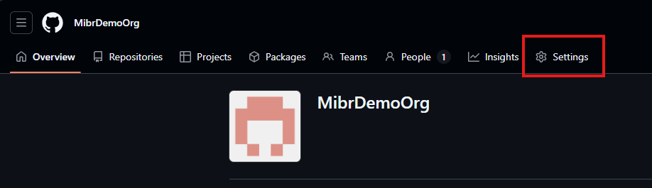
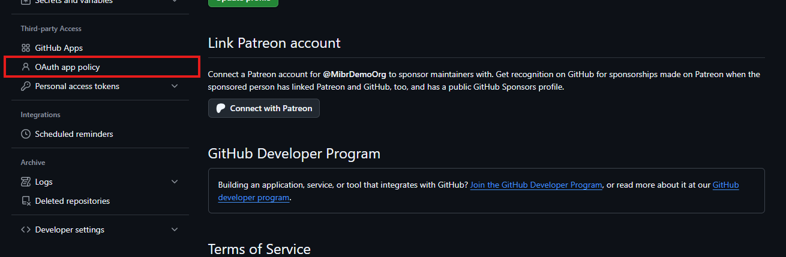
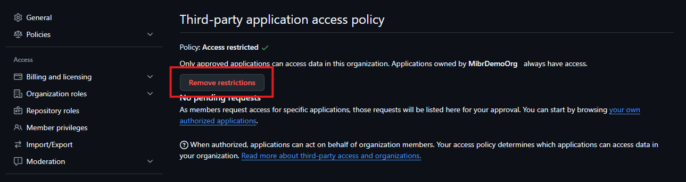
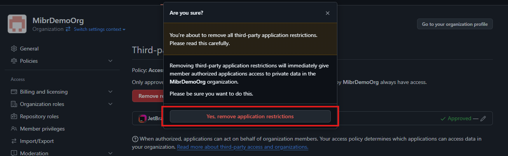
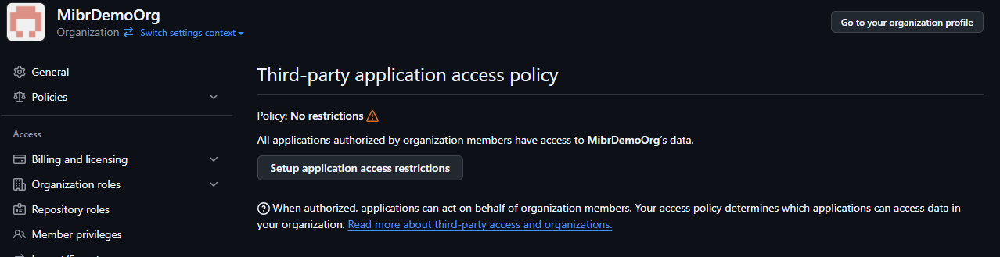
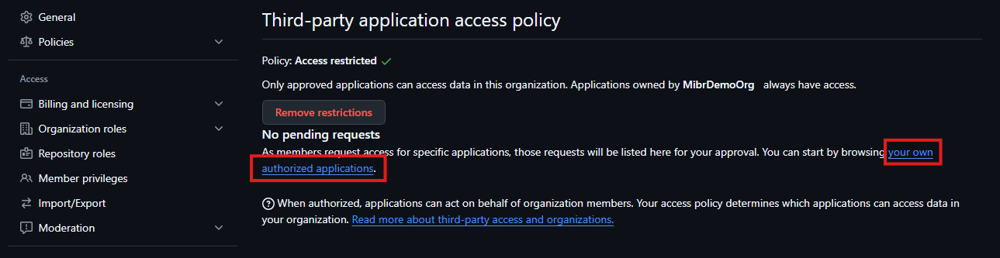
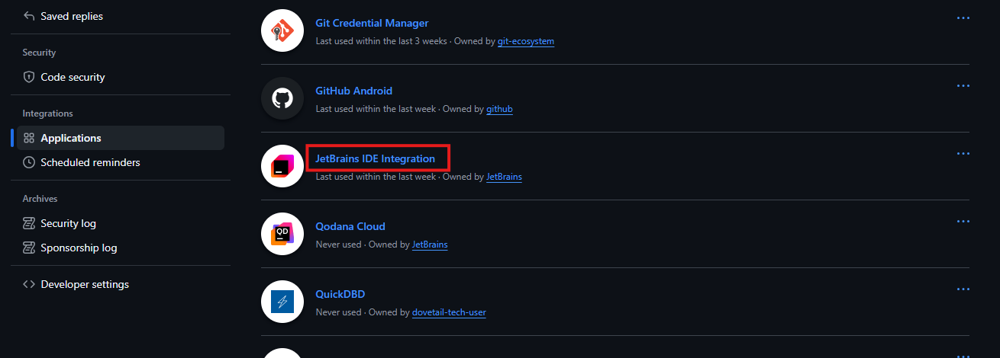
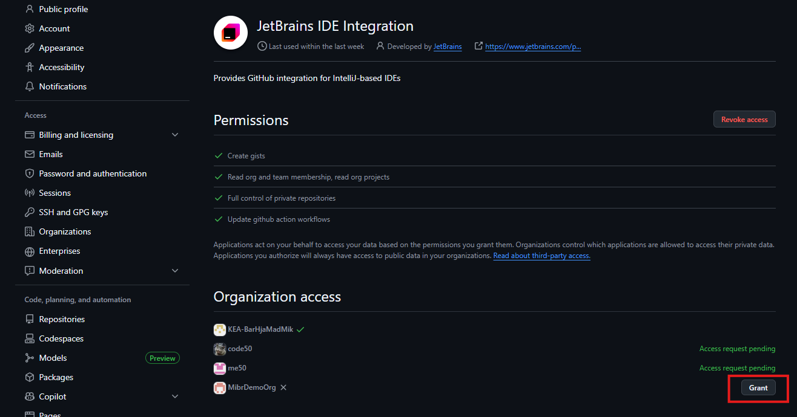
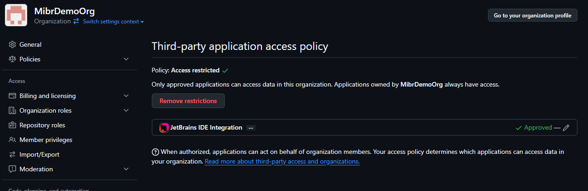

# Third-party application access policy i GitHub-organisationer

Denne guide beskriver, hvordan man kan give tredjepartsapplikationer adgang til data i sin GitHub-organisation.

Når man opretter en organisation på GitHub, følger de tredjepartsapplikationer, man har givet adgang til sin personlige konto, **ikke automatisk med**.

Ønsker man at bruge tredjepartsapplikationer – f.eks. IntelliJ – i organisationen, kræver det derfor følgende trin:

---

## Trin 1: Gå til organisationens indstillinger

Fra organisationens forside, vælg **Settings**.

---

## Trin 2: Find OAuth App Policy

I menuen til venstre, gå til **OAuth app policy**.

---

## Trin 3: Vælg tilgangsmetode

Herfra er der to muligheder:

1. **Fjern alle restriktioner** – giver adgang for alle tredjepartsapplikationer, som organisationens medlemmer allerede har godkendt på deres egne konti.  
2. **Godkend specifikke applikationer** – vælg manuelt hvilke applikationer, der må tilgå organisationens data.

---

## Option 1 – Fjern alle restriktioner

Klik på **Remove restrictions**.

Bekræft derefter valget, når GitHub beder om det.

Restriktionerne er nu fjernet.

---

## Option 2 – Godkend specifikke applikationer

Følg linket til dine egne autoriserede tredjepartsapplikationer.

*(Alternativt: Gå til din personlige konto → **Settings** → **Applications** → **Authorized OAuth Apps**).*

Find og vælg den applikation, du ønsker at give adgang til – f.eks. IntelliJ.

Klik på **Grant** ud for den organisation, som applikationen skal have adgang til.

Applikationen vil nu fremgå som **Approved**.

Gentag ovenstående trin for hver applikation, du ønsker at autorisere i organisationen.
