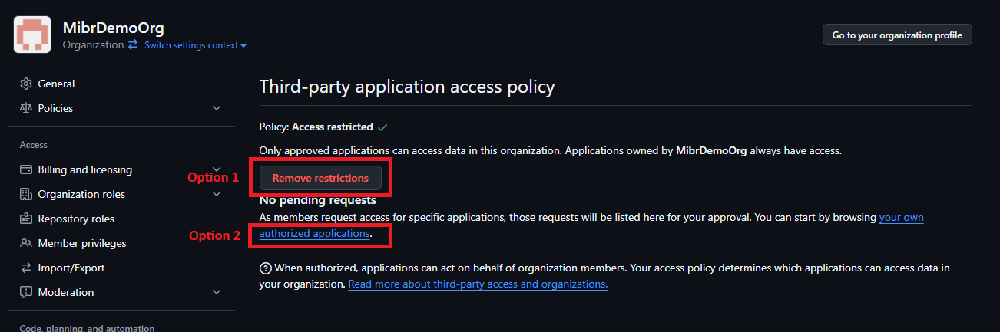
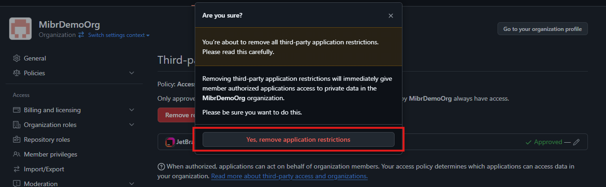
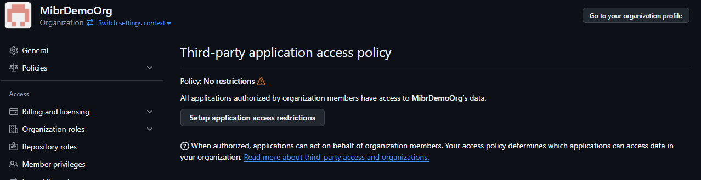

# Third-party application access policy i Github-organisationer
Denne guide beskriver, hvordan man kan give tredjepartsapplikationer adgang til en GitHub-organisation's data.

Når man opretter en organisation på GitHub følger de tredjepartapplikationer, som man har giv tilladelse til at tilgå sin personlige konto, ikke automatisk med. Ønsker man at gøre brug af tredjepartsapplikationer, som f.eks. IntelliJ, i organisationen, kræver det derfor følgende:

Fra organisations forside, gå til 'Settings'.

Lokaliser og gå til 'OAuth app policy' i venstre side.

Herfra er der to muligheder.

I kan,
1. fjerne alle restriktioner, hvilket giver adgang for alle trejdepartsapllikationer som organisationens medlemmer har givet adgang til deres egne konti.
2. giv specifikt adgang til de applikationer, der skal kunne tilgå organisationens data.

## Option 1
Tryk 'Remove restrictions'. 

Siden prompter jer til at bekræfte valget. Bekræft hvis I ønsker at fortsætte.

Restriktionerne er herefter fjernet.

## Option 2
Følg linket til jeres egne autoriserede tredjepartsapplikationer.

